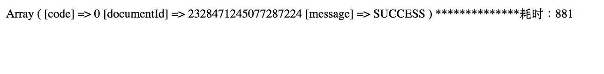
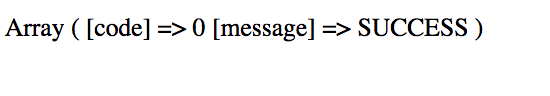
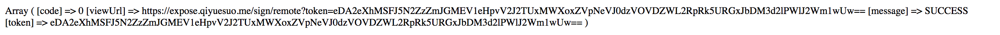
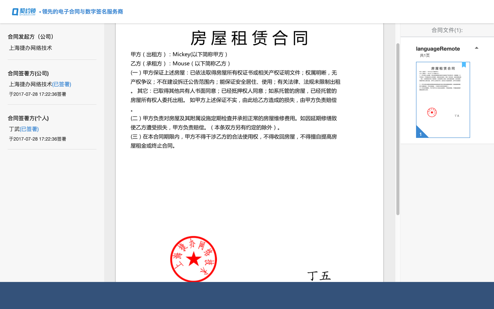

# ContractPDFGenerator

This a Contract PDf Generator for generating pdf contracts given the names and terms in html file.
Included library from:
https://github.com/barryvdh/laravel-dompdf#installation

## Setting up
git clone "https://github.com/swdk/ContractPDFGenerator"

Remember to change .env.example to .env

```
> composer update
```

```
> composer require barryvdh/laravel-dompdf
```

## Laravel 5.x:

After updating composer, add the ServiceProvider to the providers array in config/app.php

Barryvdh\DomPDF\ServiceProvider::class,
You can optionally use the facade for shorter code. Add this to your facades:

'PDF' => Barryvdh\DomPDF\Facade::class,

```
> php artisan key:generate
```
## Detailed configuration please refer to https://github.com/barryvdh/laravel-dompdf#installation


## Usage
make sure your computer have the fonts for simplified chinese, we used wts11 in this example

```
> php artisan serve
```
In your Browser :
```
> http://localhost:8000/
```
Fill out the contract details <br>
The data in form will be passed to PDFController for generating pdf <br>
The contract will be in folder storage/app <br>

## Signature

```
> http://localhost:8000/remotesigntest
```

Please refer to app/Http/Controllers/phpsdk/test/RemoteSignTest.php for more debugging messages

login to https://cloud.qiyuesuo.me/company/apisetting <br><br>
Setting the whitelist to your webserver!!!!!!<br><br>
For $results returned from qys please refer to http://open.qiyuesuo.com/document/2323093682498781193 for debugging
this test function demonstrated 4 features of the platform<br><br>
In practice, you should seperate those features into different functions and call it seperately<br><br>
The flow of the functions:<br><br>
Uploading the local contract to QYS server ->returned documentId, which you should store in db. But for testing purpose it will be stored in $documentIdGenerated<br><br>
The 2nd feature is sign by platform, you should optain sealId and set signing location<br><br>
The 3rd feature is sign by user, you should have collected user info and their sealImageBase64 image for signiture to use.<br><br>
The 4th feature is contract checking, where it will return a url to their site<br><br>


## Part 1



## Part 2


## Part 3


## Part 4


